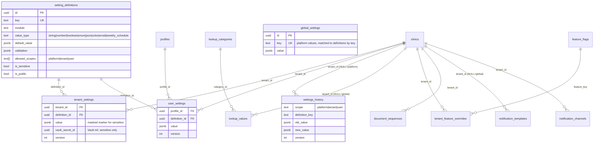

# Settings Module — Data Model

> Migrations: `prisma/migrations/08_settings_core.sql` … `12_notifications.sql` (raw SQL, applied manually in the Supabase SQL editor, in order, **before** deploying the app code). All DDL and seeds are idempotent — applying a file twice is a no-op.

## Migration order

| File | Creates |
|---|---|
| `08_settings_core.sql` | `setting_definitions`, `tenant_settings`, `user_settings`, `settings_history`; ~31 definition seeds; `settings.*` permissions + role backfill |
| `09_lookups.sql` | `lookup_categories`, `lookup_values`; 5 bilingual seed categories |
| `10_feature_flags.sql` | `feature_flags`, `tenant_feature_overrides`; 7 flag seeds + per-plan `subscription_features` entitlements |
| `11_document_sequences.sql` | `document_sequences`, `public.claim_document_number()`; `invoices.invoice_number` + backfill + partial unique index |
| `12_notifications.sql` | `notification_templates`, `notification_channels`; Vault grants; 16 global template seeds (4 keys × email/sms × en/ar) |

## ERD



## Conventions (all new tables)

- `id UUID PRIMARY KEY DEFAULT gen_random_uuid()`; snake_case names; audit block `is_active, created_at, updated_at, deleted_at, created_by, updated_by`.
- Tenant scoping column is **`tenant_id`** → `clinics(id) ON DELETE CASCADE` (config/governance convention).
- Tenant-first indexes named `idx_<table>_<cols>`.
- Seeds use deterministic UUIDs + `ON CONFLICT` (pattern from `03_seed_rbac.sql` / `05_specialties.sql`).

## Key mechanics

### Shadowing (lookups & templates)
Rows with `tenant_id NULL` are global defaults. A tenant row with the same natural key **shadows** the global row for that tenant — including `is_active = FALSE` to *hide* a global value. Tenants never edit global rows; "deleting" a global value creates an inactive shadow.

### Partial unique indexes — Prisma caveat
`lookup_values` (`(category_id, code) WHERE tenant_id IS NULL` / `(category_id, tenant_id, code) WHERE tenant_id IS NOT NULL`) and `notification_templates` (same pattern on `(channel, template_key, locale)`) are guarded by **partial unique indexes that `schema.prisma` cannot express**. The repository therefore uses **find-then-write inside a transaction** for these tables — never `prisma.upsert`. `tenant_settings`, `user_settings`, `tenant_feature_overrides`, `notification_channels`, and `document_sequences` have real composite uniques and use normal upserts.

### Atomic document numbering
`document_sequences` holds one row per `(tenant, document_type, period_key)`; each row is both counter and format config (prefix, padding, reset period). `public.claim_document_number(tenant, type)` performs a single

```sql
INSERT ... ON CONFLICT (tenant_id, document_type, period_key)
DO UPDATE SET current_value = current_value + 1 RETURNING ...
```

— the conflicting UPDATE takes a row lock, so concurrent claims serialize in the database with no app-level locking. Period keys (`''`, `'2026'`, `'2026-07'`) implement never/yearly/monthly resets; a new period starts a fresh row inheriting config from the latest row. The app claims via `sequenceService.claim(tenantId, type)` (`$queryRaw`). `invoices.invoice_number` was added and backfilled per clinic in creation order; uniqueness per clinic is a partial unique index created **after** the backfill.

### Versioning, history, rollback
Every write bumps the row's `version` and appends to **`settings_history`** (append-only: no UPDATE/DELETE RLS policies exist at all). Rollback re-writes `old_value` as a **new version** through the normal validated write path — nothing is ever destroyed. Sensitive values are stored masked in history and cannot be rolled back (secrets must be re-entered).

### Export / import
`exportTenantSettings()` produces a `clinic-settings/v1` JSON document (tenant-scope, non-sensitive keys only). Import validates **every** value against its definition first, then applies all-or-nothing in one transaction. This doubles as the tenant-level configuration backup format; platform values and history are covered by normal Postgres backups (Supabase PITR).

## Seed inventory

- **Definitions (~31)** across `organization.*`, `localization.*`, `branding.*`, `working_hours.schedule` (default Mon–Sat 09:00–17:00), `appointments.*` (slot 30min, lead 1h, advance 90d, cancel window 24h, reminders `[{email,24h}]`), `notifications.*`, `billing.*`, `preferences.theme` (user scope), `platform.*` (platform scope).
- **Lookups**: `appointment_types`, `cancellation_reasons`, `payment_methods`, `document_types` (global-only), `referral_sources` — all bilingual en/ar.
- **Feature flags**: `pharmacy`, `lab`, `online_booking` (default on) · `sms_reminders`, `advanced_reports` (pro+ entitlement) · `whatsapp_notifications`, `api_access` (enterprise entitlement, beta).
- **Templates**: `appointment.reminder|confirmed|cancelled`, `invoice.created` × email/sms × en/ar (16 global rows).
- **Permissions**: `settings.core.read|manage`, `settings.lookups.manage`, `settings.notifications.manage`, `settings.sequences.manage`, `settings.history.read|rollback`, `settings.features.read` — auto-granted to Super Admin/Tenant Owner/Administrator (all) and Manager (read-only trio) for existing tenants via the backfill DO block; new tenants get them through `auth.seed_tenant_default_rbac()`'s grant-all behavior.
